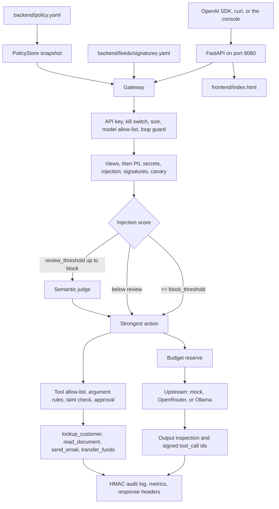

# AgentShield

Defensive AI control layer for the Goldman Sachs "AI Control Layer" task, HackYeah 2026.

AgentShield sits between an agent and the model or tools it wants to use. The agent keeps an OpenAI-compatible client. Every chat completion and gateway-mediated tool call is authenticated as a named agent, checked against one hot-reloaded policy, and appended to a tamper-evident audit log. Clear cases are decided by deterministic detectors. A semantic judge runs only in the grey zone, and only to raise risk. An information-flow guard follows secret and untrusted values out of tool results into later actions, including after those detectors are turned off.

Start with [the team collaboration guide](CONTRIBUTING.md) for branch ownership,
shared API coordination, and keeping `main` demoable.

## Why

An agent does more than answer. The shipped bank-ops agent can look up a customer, read a document, send email, and transfer funds. The policy is aimed at four ways that goes wrong:

- **Prompt injection (LLM01).** A user, or a document the agent just read, tells the model to ignore its instructions, reveal its prompt, or call a tool. Detectors scan the original text and decoded views (folded homoglyphs, collapsed spacing, split English injection keywords, base64, hex, unicode tags), including tool results when `scan_tool_results` is on.
- **Sensitive data leaving (LLM02).** Polish identifiers (PESEL, NIP, IBAN), cards, email, phone numbers, and credentials show up in the prompt or in the model output. Checksums are required for PESEL, NIP, IBAN, and card numbers. Evidence stored in the audit log is masked.
- **Excessive agency (LLM06).** The model calls a tool the agent was not granted, targets an address outside the allow rule, moves more money than `max_values` permits, or fires an irreversible payment with no human. The flow guard treats a secret tool result pasted into an egress tool, and an untrusted document choosing a recipient, as their own decisions.
- **Unbounded consumption (LLM10).** A loop, a session, or a day of calls spends tokens and money with no ceiling. Budgets are reserved before the upstream call. The judge has its own daily spend cap.

Supply-chain and output payloads (unsafe `torch.load`, shell-pipe installers, markdown image exfiltration, and the other patterns in `backend/feeds/signatures.yaml`) are `signatures.<id>` (LLM03 on input, LLM05 when the feed marks the pattern as output). A configured canary token in model output is `canary` (LLM07).

## How it works

One process serves the API and the console. `Gateway` in `backend/app/engine.py` owns the decision. `backend/app/main.py` translates HTTP.

### Request pipeline

`POST /v1/chat/completions` (OpenAI shape; `Authorization: Bearer <agent key>`, optional `X-Session`, `X-Agent-Id`, `X-Approval`):

1. Take a policy snapshot. Resolve the agent by API key (constant-time compare). Reject a missing key (`auth.missing`, 401), an unknown key (`auth.invalid`, 401), or an `X-Agent-Id` that does not match the key owner (`auth.impersonation`, 403). Reject a kill-switched agent (`tools.kill_switch`). Reject a body over `max_input_chars` (`limits.input_size`) and a model outside that agent's `allowed_models` (`model.not_allowed`).
2. Open the session from `X-Session`, or derive one. The loop guard blocks a fingerprint repeated more than `max_identical` times inside `window_seconds` (`loop.repeat`) and a session past `max_requests_per_session` (`loop.session_limit`).
3. For each `role: tool` message, verify `tool_call_id`. A signed id (`call_w.<payload>.<hmac>`) carries the tool name. A missing or forged id is labelled untrusted. Exposure is tracked per authenticated agent across client sessions.
4. Inspect every client message, including `system` and `developer` content. Scores at or above `block_threshold` block with no judge call. Scores in `[review_threshold, block_threshold)` are the grey zone. Redaction rewrites the copy that is forwarded.
5. Reserve budget under a lock and forward the same output token limit to the provider. Only one completion choice is supported. Persist dispatch admission before a provider, judge, or tool call; audit failure stops dispatch with 503. Settle on actual usage. An upstream error still settles the reservation and returns HTTP 502 `upstream_error`.
6. Inspect the assistant text (PII, secrets, canary, signatures). For each proposed tool call: allow-list, argument parse (duplicate JSON keys rejected), argument patterns and `max_values`, flow check, approval check. A call that passes is re-signed before it is returned.
7. Append the audit record, update metrics, and return the completion with `X-AgentShield-Decision`, `X-AgentShield-Overhead-Ms`, `X-AgentShield-Policy` (`<version>:<hash>`), and `X-AgentShield-Record`.

`POST /v1/tools/call` with `{"tool", "arguments"}` is the mediated path the demo uses. Order: auth, loop guard, allow-list, argument rules, flow, approval, then the in-process tool. The result is labelled from the tool's `labels`, scanned for injection, and returned with a signed `call_id`.

`stream: true` is stripped before the upstream call. The gateway inspects the full completion. An allowed response is re-emitted as SSE (`data:` chunks, then `data: [DONE]`). A block is still a JSON error.

The strongest action wins: `block` > `require_approval` > `redact` > `monitor` > `allow`. In `mode: monitor`, block, redact, and approval findings are recorded as `would_<action>` and the content is forwarded. Findings under `auth.*`, `budget.*`, `model.*`, `limits.*`, and `tools.kill_switch` still stop the request.

A block body is HTTP 403, except `budget.*` (429) and `auth.missing` / `auth.invalid` (401):

```json
{"error": {"type": "agentshield_blocked", "code": "injection.heuristic", "message": "<summary>", "record": {}, "approval_id": "<only when approval is required>"}}
```

`block_response: message` returns HTTP 200 with an assistant refusal and `finish_reason: content_filter`. The shipped file uses `error`.

### Hybrid judge

Injection score is `1 - Π(1 - weight)` over the matched rules (English, Polish, Ukrainian, Russian, and German). A hit that is found only after folding or decoding adds `injection.obfuscated` and `+0.2`, capped at 1. Shipped thresholds: block at `0.80`, review at `0.30`.

The judge runs when `semantic.enabled` is true, nothing is already a block, and the text is in the grey zone (or `semantic.trigger` is `always`). Output is judged only when `scan_output` is true (shipped: false). PII spans are redacted before the text is sent. The remote prompt wraps the text as data between a random nonce and asks for JSON `{"risk", "category", "reason"}`. A risk at or above `semantic.threshold` (shipped `0.70`) adds `semantic.judge`. A verdict below the threshold leaves the deterministic result in place.

Timeout is `timeout_ms` (1200). Three consecutive timeouts or errors open the breaker for `breaker_cooldown_s` (30); the next call is half-open. The judge's own spend is capped by `semantic.usd_per_day` (`semantic.budget`). Results are cached for 10 minutes. Backends: `openrouter`, `openai`, `ollama`, `heuristic`, `stub`. The shipped file uses OpenRouter (`google/gemini-2.5-flash-lite`, fallback `openai/gpt-4o-mini`) and `OPENROUTER_API_KEY`. With no key the judge returns an error. On `timeout`, `error`, `circuit_open`, or `budget`, grey-zone traffic follows `fail_mode`: `closed` blocks with `semantic.unavailable` (or `semantic.budget`); `open` records a monitor finding and keeps the deterministic decision. Clean traffic and scores at or above the block threshold do not wait on the judge.

`heuristic` is an offline keyword classifier, including `denied_topics`. `stub` is the deterministic test backend (`[[risk=0.9]]`, `[[timeout]]`, `[[garbage]]`).

### Information-flow guard

`flow` is not a detector. It stays on unless `flow.enabled` is `false`. Removing `controls.prompt_injection` (or turning every detector off from the console) does not turn it off. Matching uses folded forms of the tool result: digit runs, emails, IBAN-like tokens, and 12-character shingles, plus a base64, hex, and URL decode of the arguments. `min_chars` is 12.

| Rule in `policy.yaml` | Control id | Shipped action |
|---|---|---|
| `secret_to_egress` | `flow.secret_egress` | block |
| `untrusted_value_as_target` | `flow.untrusted_target` | block |
| `untrusted_before_irreversible` | `flow.untrusted_before_irreversible` | approval |

`lookup_customer` results are labelled `secret`. `read_document` results are labelled `untrusted`. `send_email` and `transfer_funds` are egress. `transfer_funds` is irreversible. A value that entered as user text, rather than as a tool result, is not in the taint store.

### Identity and approvals

An agent is its API key. `allowed_tools` missing or empty means no tools. `research-agent` may only `read_document`. `judge-sandbox` and `budget-demo` have no tools.

An irreversible tool, or the flow rule above, returns 403 `tools.approval` (or `flow.untrusted_before_irreversible`) and an `approval_id`. A person approves it on the console (`POST /api/approvals/{id}` `{"approve": true}`). The agent retries the same call with `X-Approval: <id>`. The approval is single-use, expires in `approval_ttl_s` (120), and is bound to the agent, the tool, the canonical arguments, and the policy hash. It does not authorize a tool outside the allow-list, a killed agent, a failed argument rule, or a flow block.

### Budgets

`budgets.default` is the floor. An agent's `budget` overrides the fields it sets. Checked before dispatch: `budget.max_tokens`, `budget.rpm`, `budget.tokens_per_minute`, `budget.usd` (spend plus outstanding reservations), `budget.compute`. Crossing `warn_at` (0.80) records a monitor finding. Crossing the limit blocks. `budget-demo` has `usd_per_day: 0`, so its first call is 429 and the mock model is not invoked. Day spend is rebuilt from the audit log when the process starts. Per-minute windows live in memory. Prices are `input_per_1m` and `output_per_1m` on each model. `mock/vulnerable-llm` is priced, so the demo spends real budget units offline.

### Audit

Each line in `data/audit.jsonl` (override the directory with `AGENTSHIELD_DATA_DIR`) gets `seq`, `ts`, `prev`, and `hash = HMAC-SHA256(key, prev + canonical JSON without the hash)`. The key is `AGENTSHIELD_AUDIT_KEY`, or a generated `data/audit.key`. `data/audit.head` stores the latest hash and count, so a truncated tail fails verification. `GET /api/audit/verify` checks the live chain. `GET /api/audit/verify-fixture` builds a signed chain, edits a line, and reports the break. `GET /api/report.md` is the markdown security report. Records hold the control id, masked evidence, offsets, and a masked excerpt. They do not hold the raw PESEL, card, or secret.

The console at `/` is `frontend/index.html`. It polls `GET /api/snapshot` every second: profile, mode, policy hash, posture, counts, latency, breaker, budgets, the live feed, and the why-card. Posture is `100 - sum(weight of each open gap)`, clamped to 0–100. Gaps include monitor mode, auth off, flow off, a detector off, fail-open, and an agent with no budget.

## Architecture



## Quickstart

Python 3.11 or newer. From the repository root:

```bash
pip install -r backend/requirements.txt
python3 -m uvicorn --factory app.main:create_app --app-dir backend --port 8080
open http://localhost:8080
python3 -m pytest -q
```

Run the server in one terminal and `open` plus `pytest` in another. `pytest` reads `pyproject.toml` (`pythonpath = backend`, `testpaths = tests`) and stays offline. The server writes its audit log under `./data` relative to the working directory. The default upstream for demos is `mock/vulnerable-llm`, which needs no network and no API key.

`GET /health` returns `{"status": "ok", ...}` once the policy has loaded. `GET /v1/models` lists the models the calling agent may use.

## Integration

The caller's OpenAI SDK points at the gateway. `openai` is not installed by `backend/requirements.txt`.

```python
OpenAI(base_url="http://localhost:8080/v1", api_key="wk_bank_ops_demo").chat.completions.create(model="mock/vulnerable-llm", messages=[{"role": "user", "content": "Which documents do we need for KYC of a new corporate client?"}])
```

```bash
curl -sS http://localhost:8080/v1/chat/completions \
  -H 'Authorization: Bearer wk_bank_ops_demo' \
  -H 'Content-Type: application/json' \
  -d '{"model":"mock/vulnerable-llm","messages":[{"role":"user","content":"Which documents do we need for KYC of a new corporate client?"}]}'
```

An allowed completion is the OpenAI object plus `agentshield.action`, `agentshield.seq`, and `agentshield.summary`. The same key and model work for `POST /v1/tools/call`:

```bash
curl -sS http://localhost:8080/v1/tools/call \
  -H 'Authorization: Bearer wk_bank_ops_demo' \
  -H 'Content-Type: application/json' \
  -d '{"tool":"lookup_customer","arguments":{"customer_id":"C-1001"}}'
```

`mock/vulnerable-llm` is a scripted model. Markers in the last user or tool message shape the reply: `#leak-pii`, `#leak-secret`, `#leak-system`, `#exfil`, `#code`, `#echo-tool`, and `#tool:<name> <json object>`. Anything else is a short echo. Other model ids in the policy (`openrouter/openai/gpt-4o-mini`, `openrouter/google/gemini-2.5-flash-lite`, `ollama/qwen2.5:3b`) call that upstream with httpx. `bank-ops-agent` may use `mock/vulnerable-llm` and `openrouter/openai/gpt-4o-mini`.

## Configuration

The catalog is `backend/policy.yaml`. The process `stat()`s it every 0.5 s and applies a change after the file has been stable for 150 ms. `PolicyStore` validates before the new version becomes active. A good file replaces the snapshot and bumps `policy_version`. The active hash is the first 12 hex characters of the SHA-256 of the file bytes.

These edits are rejected, and the last good version keeps enforcing:

- empty or truncated file (fewer than 50 characters after trimming), invalid YAML, or a root that is not a mapping
- missing `version`, `models`, or `agents`
- duplicate YAML keys, duplicate agent ids, or duplicate API keys
- unknown model, tool, profile, or kill-switch id
- `review_threshold` greater than or equal to `block_threshold`
- an argument regex that does not compile

Removing a section under `controls` disables that control. It does not restore a default. `flow` stays on unless the file sets `flow.enabled: false`. The console can toggle a control without rewriting the file (`POST /api/policy/toggle`, `POST /api/policy/detectors-off`, `POST /api/policy/detectors-on`). Detector toggles are runtime overrides. `detectors-off` covers injection, PII, secrets, signatures, canary, and the semantic judge. Flow stays on.

`profile` selects a deep-merge overlay. Change it in the file or with `POST /api/policy/profile/{name}`.

| Profile | Effect |
|---|---|
| `standard` | Shipped defaults. `mode: enforce`, `fail_mode: closed`, PII action `redact`. |
| `dev` | `mode: monitor`, `fail_mode: open`. |
| `strict` | PII action `block`. Injection block at 0.60, review at 0.15. Semantic `trigger: always`, threshold 0.50. |

`fail_mode` applies when the judge does not return a verdict on grey-zone traffic. `closed` blocks. `open` allows that traffic through with a monitor finding. It does not skip detectors.

Shipped agents (demo keys, committed for the jury):

| Agent | Key | Tools | Budget override |
|---|---|---|---|
| `bank-ops-agent` | `wk_bank_ops_demo` | `lookup_customer`, `read_document`, `send_email`, `transfer_funds` | 0.50 USD/day, 2000 tokens/request |
| `research-agent` | `wk_research_demo` | `read_document` | default (2.00 USD/day) |
| `judge-sandbox` | `wk_judge` | none | 1.00 USD/day |
| `budget-demo` | `wk_budget_demo` | none | 0 USD/day |

`send_email.to` must match `^[\w.+-]+@bank\.example$`. `transfer_funds.amount` must be numeric and at most 10000. Canary token in the shipped file: `WRDN-CANARY-7F3A`.

Environment:

| Variable | Role |
|---|---|
| `OPENROUTER_API_KEY` | Judge and OpenRouter upstreams. Absent: judge status `error`, grey zone follows `fail_mode`. |
| `AGENTSHIELD_AUDIT_KEY` | HMAC key for the audit chain. Otherwise `data/audit.key` is created. |
| `AGENTSHIELD_POLICY` | Policy path. Default `backend/policy.yaml`. |
| `AGENTSHIELD_DATA_DIR` | Audit, approvals, kill switch. Default `data` in the current directory. |
| `AGENTSHIELD_ADMIN_TOKEN` | Required for all `/api/` endpoints and `/metrics` using `X-Admin-Token`. Without it, console APIs are disabled (503). Enter it in dashboard Settings and export it for demo scripts. |

`GET /metrics` is a live Prometheus text snapshot (decision counts, overhead, breaker, posture, budget). There is no scraper config in the repo.

## Controls

OWASP tags are the LLM Top 10 ids the finding carries. Signature rows keep the tag from the feed (`LLM03` or `LLM05`).

| Control id | What it stops | Shipped action | OWASP |
|---|---|---|---|
| `pii.email` `pii.phone` `pii.pesel` `pii.nip` `pii.iban` `pii.credit_card` | Those entities on input and output. Bad checksums are ignored. Redaction tokens look like `[PESEL]`. | redact | LLM02 Sensitive Information Disclosure |
| `secrets.aws` `secrets.github` `secrets.openai` `secrets.anthropic` `secrets.openrouter` `secrets.slack` `secrets.google` `secrets.stripe` `secrets.pem` `secrets.jwt` `secrets.connstr` `secrets.generic` | Credentials, private-key headers, connection strings, and high-entropy assignments. | block | LLM02 |
| `injection.heuristic` `injection.obfuscated` | Model-directed override, jailbreak, and exfiltration phrases, including matches that appear only after folding or decoding. | block at score ≥ 0.80; grey zone from 0.30 | LLM01 Prompt Injection |
| `signatures.<id>` | One id per row in `backend/feeds/signatures.yaml` (pickle, `torch.load`, remote code, known AI-infra CVEs, shell installers, SSRF metadata, path traversal, markdown image exfil, jailbreak markers, log4shell, and the rest of that file). | block | LLM03 Supply Chain, or LLM05 Improper Output Handling when the feed says so |
| `canary` | A configured canary token in output. | block | LLM07 System Prompt Leakage |
| `semantic.judge` | Judge risk at or above `semantic.threshold`. | block | LLM01 |
| `semantic.unavailable` | Judge timeout, error, or open breaker on grey-zone traffic. | block if `fail_mode: closed`, else monitor | LLM01 |
| `semantic.budget` | Judge spend for the day is exhausted. | same as unavailable | LLM01 |
| `flow.secret_egress` | A secret tool result reused in an egress tool's arguments. | block | LLM06 Excessive Agency |
| `flow.untrusted_target` | An untrusted tool result reused in a target argument (`to`, `iban`, …). | block | LLM06 |
| `flow.untrusted_before_irreversible` | Any untrusted label in the session before an irreversible tool. | require approval | LLM06 |
| `tools.allowlist` | Tool not in this agent's `allowed_tools`. | block | LLM06 |
| `tools.unknown` | Tool name absent from the policy catalog. | block | LLM06 |
| `tools.args` | Arguments are not a JSON object, or they contain duplicate keys or non-finite numbers. | block | LLM06 |
| `tools.arg_pattern` | Argument fails `arg_patterns` or hits `deny_arg_patterns`. | block | LLM06 |
| `tools.max_value` | Numeric argument above `max_values`. | block | LLM06 |
| `tools.approval` | Irreversible tool without a valid single-use approval. | require approval | LLM06 |
| `tools.kill_switch` | Agent id is in `kill_switch` or was killed at runtime (`POST /api/kill/{agent_id}`). | block | LLM06 |
| `loop.repeat` | Same fingerprint more than `max_identical` times in the window. | block | LLM10 Unbounded Consumption |
| `loop.session_limit` | More requests in the session than `max_requests_per_session`. | block | LLM10 |
| `budget.usd` `budget.tokens_per_minute` `budget.rpm` `budget.max_tokens` `budget.compute` | Daily spend, tokens per minute, requests per minute, tokens per request, compute seconds. | block, HTTP 429 | LLM10 |
| `auth.missing` `auth.invalid` | No bearer key, or a key that matches no agent. | block, HTTP 401 | LLM06 |
| `auth.impersonation` | `X-Agent-Id` does not match the key owner. | block, HTTP 403 | LLM06 |
| `model.not_allowed` | Model id is unknown, or not in the agent's `allowed_models`. | block | LLM10 |
| `limits.input_size` | Empty `messages`, or total message characters above `max_input_chars` (40000). | block | LLM10 |

## Demo

Start the gateway with the quickstart command, then from the repository root:

```bash
./demo/run_demo.sh
```

The script is curl only. It needs bash, curl, and python3, and it expects `GET /health` on `http://localhost:8080` with the default policy. `GW=http://host:8080 ./demo/run_demo.sh` points elsewhere. `PAUSE=1 ./demo/run_demo.sh` waits for Enter between steps.

1. A benign KYC question from `judge-sandbox` is allowed and forwarded to `mock/vulnerable-llm`.
2. PESEL `44051401359` is redacted before the model sees it. `44051401358` fails the checksum and stays.
3. A Polish instruction to ignore previous instructions is blocked. The same English instruction, base64-encoded, is blocked via the decoded view.
4. `POST /api/policy/detectors-off` disables the detectors. `lookup_customer` then `send_email` of that IBAN is blocked with `flow.secret_egress`. `read_document` of `invoice-7` (hidden instruction, untrusted) then `send_email` toward the injected recipient is blocked. Reusing the IBAN in a different session is also blocked: changing `X-Session` cannot erase the agent's exposure. The script turns the detectors back on.
5. A broken YAML body is posted to `POST /api/policy`. The active policy hash stays the same, and an English injection is still blocked. If `backend/policy.yaml` is writable, the script also plants an invalid file for about 1.2 s and restores the backup. `EDIT_FILE=0` skips that disk write.
6. `budget-demo` is rejected with HTTP 429 before the mock model runs.
7. `transfer_funds` of 2500 needs a human. The script approves the id, retries with `X-Approval`, shows that the same id cannot be replayed, and shows that amount 50000 is blocked by `tools.max_value`.
8. `GET /api/audit/verify` accepts the live chain. `GET /api/audit/verify-fixture` reports the edited line. The script prints the top of `GET /api/report.md` and the snapshot counts.

The console at `http://localhost:8080` is the same API the script calls: try-it, the why-card, approvals, the policy editor, and audit verify.

## Team

Four workstreams, one policy and one set of shared types in `backend/app/models.py`:

- **backend-core:** API, policy engine, gateway, budget, and audit (`backend/app/main.py`, `engine.py`, `policy.py`, `budget.py`, `audit.py`, `metrics.py`, `governance.py`, `backend/policy.yaml`).
- **guardrails:** normalization, PII, secrets, injection, signatures, and the semantic judge (`backend/app/guardrails/`, `backend/feeds/signatures.yaml`).
- **frontend:** the operations console (`frontend/index.html`).
- **tests-demo:** the suite, the mock tools, and the scripted demo (`tests/`, `backend/app/tools/`, `demo/run_demo.sh`).

Shared contracts for control ids, HTTP, and the decision record are in `docs/CONTRACTS.md`. The design note is `docs/ARCHITECTURE.md`.

## Limitations

- Flow matching is literal on preserved forms (digit runs, emails, IBAN-like tokens, folded shingles of at least 12 characters, and base64, hex, or URL decodes of the arguments). A paraphrase that drops those forms is outside the guard. Taint is stored per authenticated agent in memory and is gone after a restart. Only the three rules in `flow.rules` are implemented.
- The judge raises risk. It is not called once a deterministic block exists, and a low verdict does not erase that block. The shipped backend is OpenRouter. Offline runs that want a judge should set `semantic.backend` to `heuristic` or `stub`. The heuristic is a keyword list, which the module itself treats as a stand-in for a remote model when paraphrase coverage matters.
- Identity is the bearer key in the policy (or `api_key_env`). The demo keys above are public demo credentials; use private environment-backed keys in deployments. Console APIs require `AGENTSHIELD_ADMIN_TOKEN` and disable themselves when it is unset. The authenticated policy editor masks keys and preserves unchanged markers on save. See [security boundaries and setup](docs/SECURITY.md).
- Approvals expire in 120 seconds, are single-use, and are tied to one agent, tool, argument object, and policy hash. A flow block is not approvable.
- The audit chain detects an edited, reordered, deleted, or tail-truncated log while `audit.head` is intact. Replacing the log and the head together is outside what the process can see. Keep a copy of the head if that threat matters.
- Budget reservations and per-minute windows are in-process. After a restart, daily USD is restored from the audit log; the minute windows start empty.
- Completions are buffered. There is no mid-token cut-off. SSE is a replay of the inspected message.
- Tools the gateway executes are the four functions in `backend/app/tools`. `mcp_servers` is accepted by the policy schema. The shipped tree does not start an MCP server. `main.py` will mount `app.mcp_proxy` or `app.anthropic_adapter` only when that module defines `register`; neither module is in the tree, so `/mcp/...` and `/v1/messages` are not served.
- The signature file is a local regex catalog with hot reload and last-good rejection. It is not a live feed.
- This build does not include natural-language policy authoring, shadow replay, OCSF or CEF export, a Prometheus server, Redis, or a separate Next.js app.
